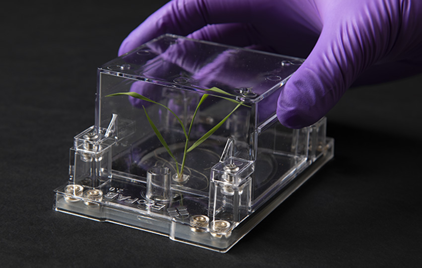

<!-- ---
banner: _static/ecofab.png
banner_height: "40vh"
--- -->


# Welcome to RhizoNet Documentation



Welcome to the official documentation for RhizoNet! This guide will help you understand, install, and use the RhizoNet pipeline effectively.

---

## 🚀 Overview

**RhizoNet** is a segmentation pipeline. It is designed to:
- Train a new set of 2D images from scratch 
- Conduct inference on a new set of images either EcoFAB 2.0 images or the set that used for training prior to inference
- Run post-processeing methods on predicted images using mathematical image processing techniques. 

Learn more about the project on [GitHub](https://github.com/lbl-camera/rhizonet).

---

## 📚 Table of Contents

- [Introduction](introduction.md): Learn the basics of Project Name.
- [Getting Started](getting-started.md): Step-by-step guide to set up and start using Project Name.


```{toctree}
---
maxdepth: 2
caption: RhizoNet
---
api/utils.md
api/prepare_patches.md
api/unet2D.md
api/train.md
api/predict.md
api/postprocessing.md
api/metrics.md

```
<!-- - [API Reference](api-reference.md): Detailed documentation of the APIs. -->
<!-- - [FAQs](faq.md): Frequently Asked Questions. -->
<!-- - [Contributing](contributing.md): Guidelines for contributing to the project. -->

---

## 🔧 Installation

To install RhizoNet, use:

```bash
pip install rhizonet
